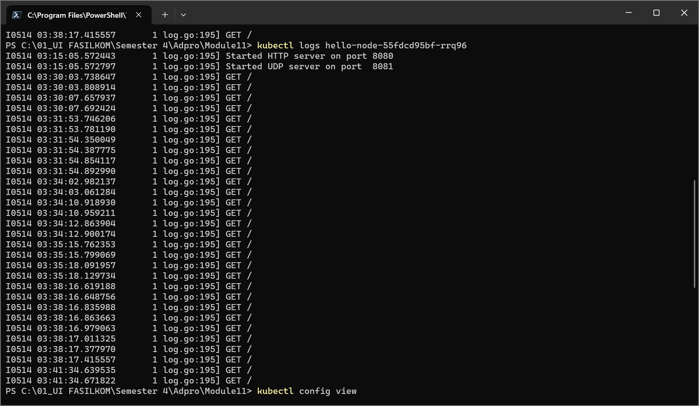
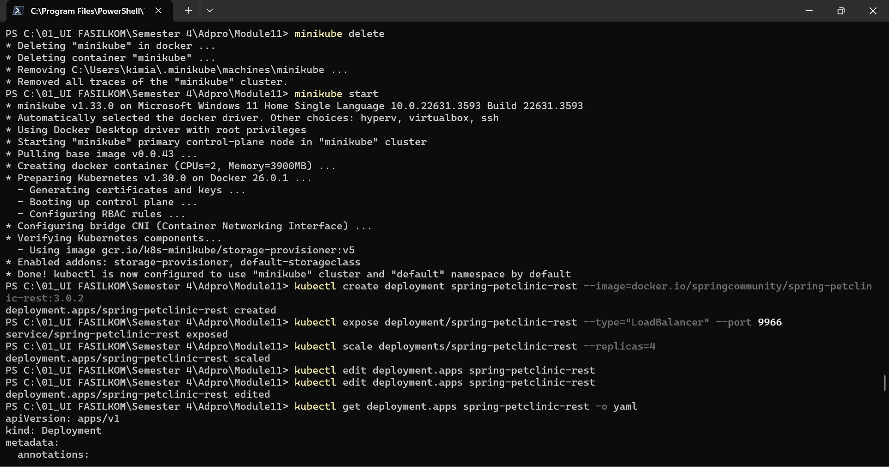
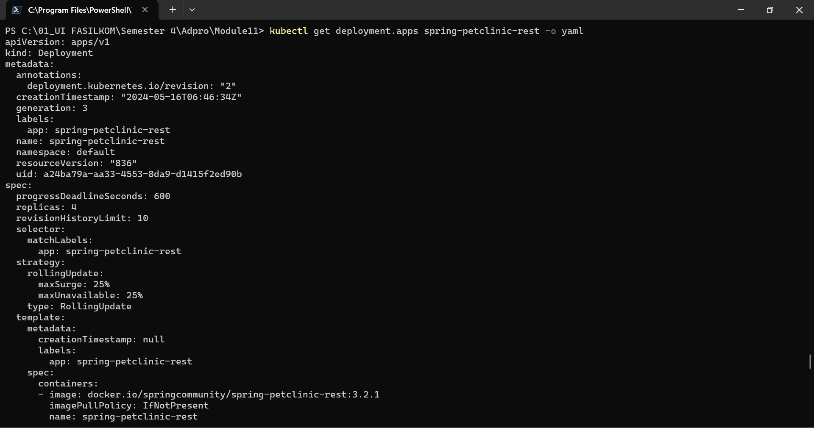
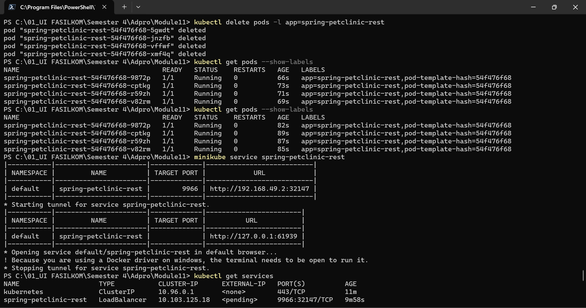

# Reflection
## Reflection on Hello Minikube
1. Ketika saya membuka aplikasi beberapa kali, terlihat pada log request GET terjadi. Di bawah ini terdapat screenshot tampilan logs.

2. Saat mengeksekusi perintah `kubectl get`, option `-n` bertujuan untuk menentukan namespace yang ingin ditampilkan informasinya. Namespace pada Kubernetes bertujuan untuk mempartisi resources menjadi beberapa cluster. Tanpa option `-n`, akan muncul informasi dari namespace default. Output tidak memberikan list pods/services yang dibuat karena hal-hal tersebut berada pada namespace `default`.

## Reflection on Rolling Update & Kubernetes Manifest File

1. Rolling update akan meng-update pods secara bertahap sehingga tidak diperlukan adanya downtime. Jika terdapat masalah saat proses update, dapat dilakukan rollback. Metode Recreate akan menghentikan seluruh pods dan membuat pods baru sehingga akan terdapat downtime pada aplikasi
2. Deploying the Spring Petclinic REST using Recreate deployment strategy 
Pertama, saya membuat lembali deployment spring-petclinic-rest pada versi 3.0.2. Setelah itu, saya mengganti versi dari template dengan menjalankan perintah `kubectl edit deployment.apps spring-petclinic-rest`

Terlihat bahwa versi berhasil diperbarui pada screenshot ini

Selanjutnya dilakukan penghapusan pada pods dan otomatis akan dibuat kembali pods yang baru. Terakhir, service dapat di-run.

3. Setelah melakukan langkah-langkah pada nomor 2, saya menjalankan perintah `kubectl get deployments/spring-petclinic-rest -o yaml > deployment2.yaml` dan `kubectl get services/spring-petclinic-rest -o yaml > service2.yaml`. Kedua file tersebut tersedia pada repository ini.
4. Menggunakan manifest file dapat memperkecil kemungkinan terjadinya error pada saat deployment, karena bisa saja terdapat kesalahan pengetikan ketika mengeksekusi perintah satu-persatu pada terminal. Selain itu, waktu deployment akan menjadi lebih cepat karena hanya perlu mengeksekusi manifest file sekali untuk deploy.